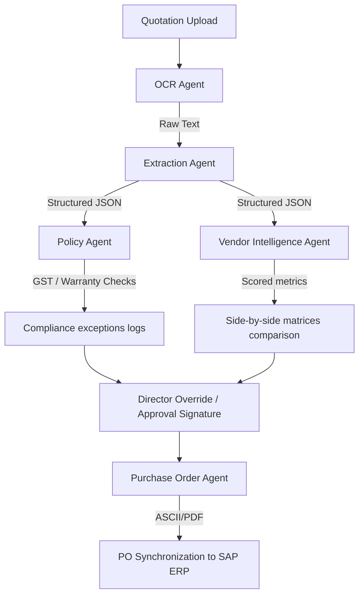
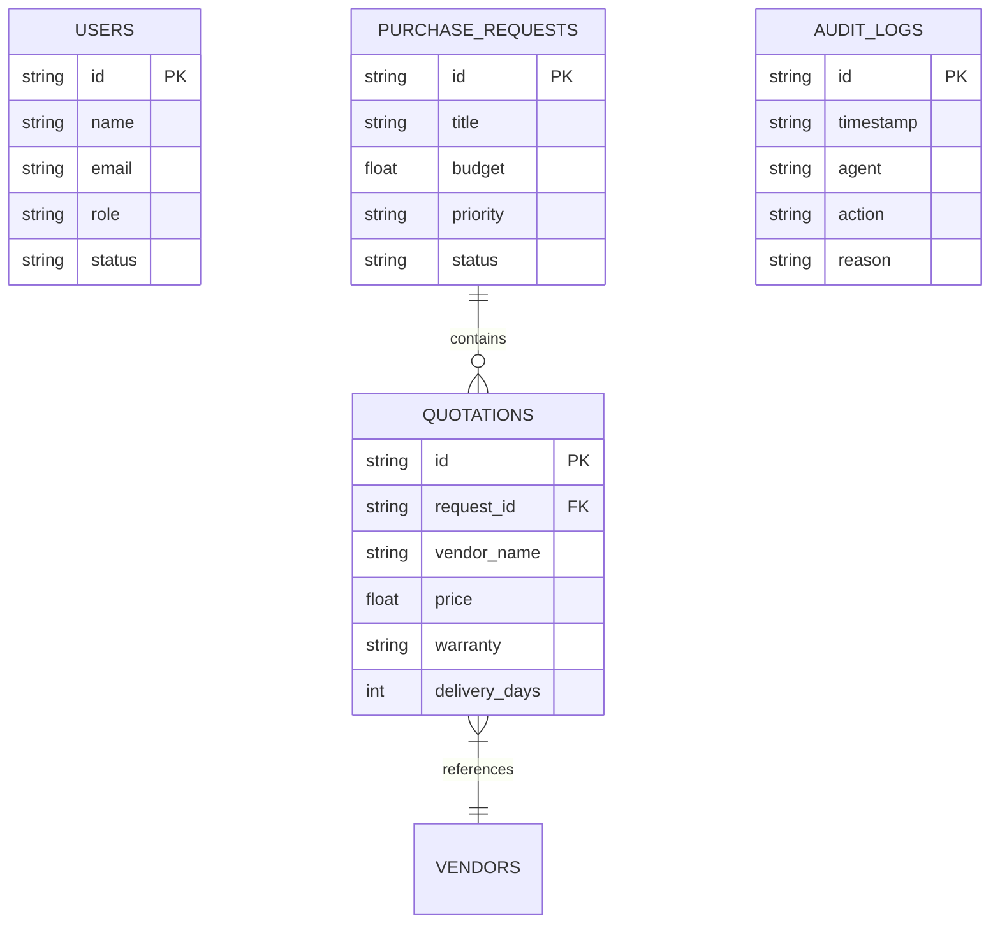

# Procura Platform Architecture

Procura is structured as a modular full-stack web application designed for enterprise procurement auditing.

## Tech Stack Overview

- **Frontend**: React (TypeScript), TailwindCSS, Recharts (visual spend and resource utilization), framer-motion (micro-animations), and Lucide-icons.
- **Backend**: FastAPI (Python), ASGI server (Uvicorn), JWT authorization guards.
- **Database**: SQLAlchemy ORM mapping SQLite (local development file) and PostgreSQL (production instance pools).
- **AI Orchestration**: Custom multi-agent sequencing pipeline.

## Multi-Agent System Diagram

## Database Schema Diagram

