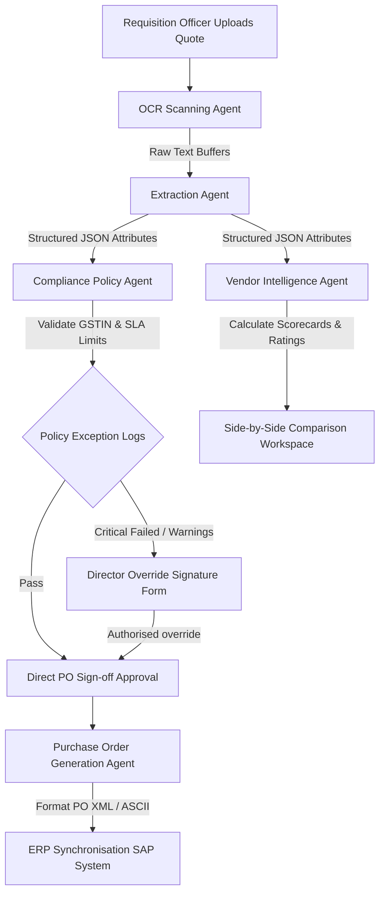

# Procura Platform Workflow & High-Level Design Documentation

This document provides a comprehensive overview of Procura's enterprise workflow pipeline, technological stack components, data models, and high-level design specifications.

---

## 1. System Workflow Chart

The diagram below outlines the sequential quotation processing lifecycle as it passes through the multi-agent AI pipeline to final ERP PO synchronization.



---

## 2. Pipeline Workflow Explanation

1. **Quotation Ingestion**: The procurement workflow starts when a procurement officer uploads quotation files (PDF/PNG invoices or bids) for an active purchase request.
2. **AI OCR Parsing**: The `OCRAgent` receives the files and uses layout-aware optical character recognition to extract unstructured text segments.
3. **Structured Extraction**: The `ExtractionAgent` processes raw text buffers to isolate parameters (supplier metadata, pricing items, tax IDs, warranty dates, and delivery lead times).
4. **Cooperative Validation**:
   - The **Policy Agent** evaluates these parameters against company regulations (POL-001 through POL-004), checking GST database registration and delivery SLA compliance.
   - The **Vendor Intelligence Agent** measures the pricing against historical averages to compile vendor rating metrics.
5. **Human-in-the-Loop Override**: Any policy violations trigger immediate exception flags. Authorized managers can enter justification remarks and supply digital signatures to override constraints.
6. **ERP Integration**: Once compliance check-offs are complete, the `POAgent` generates formal purchase orders and synchronizes records directly with ERP endpoints (e.g. SAP/Oracle databases).

---

## 3. Technology Code Stack

| Tech Layer | Framework / Library | Role & Functionality |
|---|---|---|
| **Frontend** | React 18, TypeScript, Vite | Dynamic, single-page application framework. |
| **Styling** | Vanilla CSS, TailwindCSS | Curated responsive styling and dark mode templates. |
| **Animations** | Framer Motion | Smooth dashboard transitions and modal popovers. |
| **Charts** | Recharts | Render monthly spend trends and vendor radar data. |
| **Icons** | Lucide React | Modern visual interface iconography. |
| **Backend** | Python 3.12, FastAPI | Core routing, schema validation, and API controllers. |
| **Server** | Uvicorn | High-performance ASGI web server interface. |
| **Database** | SQLAlchemy 2.0, SQLite / PostgreSQL | Object Relational Mapping (ORM) and connection pools. |
| **CI / CD** | GitHub Actions | Automated tests execution and compiler checks pipeline. |

---

## 4. High-Level Design (HLD)

### Database Schemas

1. **Requisitions (`PURCHASE_REQUESTS`)**:
   - `id` (String, Primary Key)
   - `title` (String, Requisition item description)
   - `budget` (Float, Maximum ceiling)
   - `priority` (String, Critical / High / Medium / Low)
   - `status` (String, Open / Under Review / Approved / Rejected)
2. **Quotations (`QUOTATIONS`)**:
   - `id` (String, Primary Key)
   - `request_id` (String, Foreign Key)
   - `vendor_name` (String, Supplier name)
   - `price` (Float, Quoted cost)
   - `warranty` (String, Warranty years support)
   - `delivery_days` (Integer, Lead time SLA)
3. **Audit Ledger (`AUDIT_LOGS`)**:
   - `id` (String, Primary Key)
   - `timestamp` (DateTime, Log timestamp)
   - `agent` (String, Action initiator)
   - `action` (String, Task performed)
   - `reason` (String, Override justification remarks)

### Core Folder Structure

```text
procura/
├── .github/workflows/   # CI/CD pipelines (ci.yml)
├── agents/              # Multi-agent services source
│   ├── ocr/             # OCR parser services
│   ├── extraction/      # Attribute extraction services
│   └── policy/          # Compliance validation checks
├── backend/
│   ├── app/
│   │   ├── api/         # FastAPI endpoints and route handlers
│   │   ├── models/      # SQLAlchemy ORM models
│   │   └── tests/       # Pytest backend test suite
└── frontend/
    ├── src/
    │   ├── layouts/     # Global layout components (MainLayout.tsx)
    │   └── pages/       # Workspace routes (Dashboard, PolicyValidation)
```
