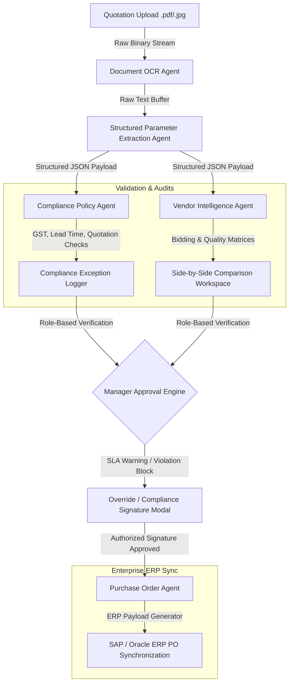

# Procura: Workflow, Architecture, and Product Requirements (PRD)

This document provides a comprehensive blueprint of Procura's enterprise decision intelligence pipeline, system architecture, technology stack, high-level designs, and product specifications.

---

## 1. Complete Workflow Chart

The following Mermaid diagram outlines the end-to-end workflow from invoice quotation upload to final ERP PO synchronization:



### Workflow Explanation
1. **Document Ingestion**: Requisitioners upload raw quotation images or PDFs.
2. **OCR Parsing**: The `OCRAgentService` processes the documents and extracts unformatted text blocks.
3. **Extraction & Normalization**: The `ExtractionAgentService` parses the raw text into a normalized JSON structure containing prices, warranties, delivery times, and GST numbers.
4. **Policy Verification**: The `PolicyAgent` checks the extracted terms against active corporate guidelines (e.g., POL-001 for GSTIN validity). If a rule fails, the workflow is blocked until an authorized manager overrides it.
5. **Vendor Intel**: Side-by-side comparison matrices analyze the quotes against historical pricing to calculate estimated savings.
6. **Decision & ERP Sync**: Authorized officers override warnings with signatures. Once cleared, the `POAgent` syncs the approved orders into SAP/Oracle ERP databases.

---

## 2. Technology Stack Explanation

| Component | Technology | Rationale |
|---|---|---|
| **Frontend** | React 18, TypeScript | Modular, type-safe development ensuring robust state management. |
| **Styling** | Vanilla CSS, TailwindCSS | Highly flexible responsive layout framework matching enterprise dashboards. |
| **Visualizations** | Recharts | Renders interactive area trends, pie distribution metrics, and vendor SLA charts. |
| **Icons** | Lucide React | High-density vector icons providing clean system indicators. |
| **Backend** | Python 3.12, FastAPI | Extremely performant, lightweight, and type-safe ASGI REST framework. |
| **Database** | SQLAlchemy 2.0 ORM | Maps relational entities to local SQLite and production PostgreSQL instances. |

---

## 3. High-Level Design (HLD)

Procura uses a multi-agent architectural model where each micro-agent maintains independent input/output boundaries to process quotations:

### Database Entity Model
```text
  [Purchase Requests] ───1:N─── [Quotations]
           │
           └───1:1─── [Purchase Orders] ───1:1─── [Audit Logs]
```

### Role-Based Access Controls (RBAC)
- **Procurement Officer (Product Manager)**: Manages purchase requests, uploads quotes, and reviews vendor comparisons.
- **Approving Manager (Executive Officer)**: Inspects compliance exceptions and applies override signatures to bypass blocks.
- **System Administrator**: Full system control, log monitoring, and database management.

---

## 4. Product Requirements Document (PRD) & User Stories

### Target User Personas
1. **Sarah (Procurement Officer)**: Needs to quickly extract quotation data from supplier PDFs to generate comparison sheets without manual typing.
2. **Robert (Approving Manager)**: Needs to review policy warnings and sign off on exceptions from his mobile device.

### User Stories
- **User Story 1**: As a Procurement Officer, I want the system to parse invoice items automatically using OCR so that I do not have to manually input data.
- **User Story 2**: As an Approving Manager, I want to see a clear compliance summary modal when an invoice checks fail so that I can make an informed override decision.
- **User Story 3**: As an Executive Officer, I want to compare vendor creditworthiness, cost deltas, and SLA reliabilities side-by-side in a secure matrix view.

---

## 5. Tagged Release Details

- **Current Release**: `v1.1.0` (Production Stable)
- **Release Highlights**:
  - Global Company Rules Library integration inside the left sidebar.
  - Interactive KPI cards with slide-in breakdown modals.
  - Role-based detailed comparison matrices for Executive Officers.
